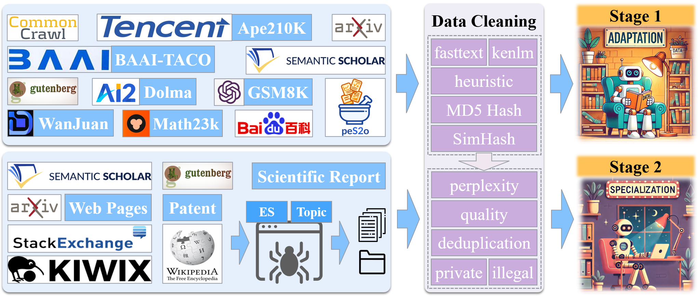

<div align="center">
    <h1>
        JiuZhou: Open Foundation Language Models for Geoscience
    </h1>
</div>


\[ English | [中文](README_zh.md) \]

## 🎉 News
- [2024-10-11] WeChat article: [PreparedLLM: Effective Pre-pretraining Framework for Domain-specific Large Language Models](https://mp.weixin.qq.com/s/ugJQ9tbp6Y87xA3TOWteqw).
- [2024-09-06] Released [ClimateChat](https://huggingface.co/itpossible/ClimateChat) instruct model.
- [2024-08-31] **Article [PreparedLLM: Effective Pre-pretraining Framework for Domain-specific Large Language Models](https://www.tandfonline.com/doi/full/10.1080/20964471.2024.2396159) has been accepted for publication in the *Big Earth Data* journal**.
- [2024-08-31] Released [Chinese-Mistral-7B-Instruct-v0.2](https://huggingface.co/itpossible/Chinese-Mistral-7B-Instruct-v0.2) instruct model. Significant improvements in language understanding and multi-turn dialogue capabilities.
- [2024-06-30] Released [JiuZhou-Instruct-v0.2](https://huggingface.co/itpossible/JiuZhou-Instruct-v0.2) instruct model. Significant improvements in language understanding and multi-turn dialogue capabilities.
- [2024-05-15] WeChat Article: [Chinese Vocabulary Expansion Incremental Pretraining for Large Language Models: Chinese-Mistral Released](https://mp.weixin.qq.com/s/PMQmRCZMWosWMfgKRBjLlQ).
- [2024-04-04] Released [Chinese-Mistral-7B-Instruct-v0.1](https://huggingface.co/itpossible/Chinese-Mistral-7B-Instruct-v0.1) instruct model.
- [2024-03-31] Released [Chinese-Mistral-7B-v0.1](https://huggingface.co/itpossible/Chinese-Mistral-7B) base model.
- [2024-03-15] Released the base version [JiuZhou-base](https://huggingface.co/itpossible/JiuZhou-base), instruct version [JiuZhou-instruct-v0.1](https://huggingface.co/itpossible/JiuZhou-Instruct-v0.1), and [intermediate checkpoints](https://huggingface.co/itpossible).


## Table of Contents

- [Introduction](#introduction)
- [Download](#download)
- [Inference](#inference)
- [Model Performance](#model-performance)
- [Model Training Process](#model-training-process)
- [Model Training Code](#model-training-code)
- [Citations](#citations)
- [Acknowledgments](#acknowledgments)

## Introduction
The field of geoscience has amassed a vast amount of data, necessitating the extraction and integration of diverse knowledge from this data to address global change challenges, promote sustainable development, and accelerate scientific discovery. Foundation language models initially learn and integrate knowledge autonomously through self-supervised pre-training on extensive text data. Subsequently, they acquire the capability to solve geoscience problems through instruction tuning. However, when the foundational language models lack sufficient geoscience expertise, instruction tuning with relevant data can lead to the generation of content that is inconsistent with established facts. To improve the model's accuracy and practicality, a robust geoscience foundational language model is urgently needed.<br>

This study uses [Mistral-7B-v0.1](https://huggingface.co/mistralai/Mistral-7B-v0.1) as the base model and continues pretraining on a large geoscience corpus. It also incorporates the [domain-specific large language model *pre*-pretraining framework (PreparedLLM)](https://www.tandfonline.com/doi/full/10.1080/20964471.2024.2396159) and the "two-stage pre-adaptation pre-training" algorithm to build the geoscience large language model, JiuZhou.


## Download

| **Model Series**      | **Model**                           | **Download Link**                                           | **Description**                                                  |
|-----------------------|-------------------------------------|------------------------------------------------------------|------------------------------------------------------------------|
| **JiuZhou**           | JiuZhou-base                        | [Huggingface](https://huggingface.co/itpossible/JiuZhou-base) | Base model (Rich in geoscience knowledge)                     |
| **JiuZhou**           | JiuZhou-Instruct-v0.1               | [Huggingface](https://huggingface.co/itpossible/Chinese-Mistral-7B-Instruct-v0.1) | Instruct model (Instruction alignment caused a loss of some geoscience knowledge, but it has instruction-following ability) <br> LoRA fine-tuned on Alpaca_GPT4 in both Chinese and English and GeoSignal |
| **JiuZhou**           | JiuZhou-Instruct-v0.2               | [HuggingFace](https://huggingface.co/itpossible/Chinese-Mistral-7B-Instruct-v0.2)<br>[Wisemodel](https://wisemodel.cn/models/itpossible/Chinese-Mistral-7B-Instruct-v0.2) | Instruct model (Instruction alignment caused a loss of some geoscience knowledge, but it has instruction-following ability) <br> Fine-tuned with high-quality general instruction data |
| **ClimateChat**       | ClimateChat                         | [HuggingFace](https://huggingface.co/itpossible/ClimateChat)<br>[Wisemodel](https://wisemodel.cn/models/itpossible/ClimateChat) | Instruct model <br> Fine-tuned on JiuZhou-base for instruction following |
| **Chinese-Mistral**   | Chinese-Mistral-7B                  | [HuggingFace](https://huggingface.co/itpossible/Chinese-Mistral-7B-v0.1)<br>[Wisemodel](https://wisemodel.cn/models/itpossible/Chinese-Mistral-7B-v0.1)<br>[ModelScope](https://www.modelscope.cn/models/itpossible/Chinese-Mistral-7B-v0.1) | Base model                                                      |
| **Chinese-Mistral**   | Chinese-Mistral-7B-Instruct-v0.1    | [HuggingFace](https://huggingface.co/itpossible/Chinese-Mistral-7B-Instruct-v0.1)<br>[Wisemodel](https://wisemodel.cn/models/itpossible/Chinese-Mistral-7B-Instruct-v0.1)<br>[ModelScope](https://www.modelscope.cn/models/itpossible/Chinese-Mistral-7B-Instruct-v0.1) | Instruct model <br> LoRA fine-tuned with Alpaca_GPT4 in both Chinese and English |
| **Chinese-Mistral**   | Chinese-Mistral-7B-Instruct-v0.2    | [HuggingFace](https://huggingface.co/itpossible/Chinese-Mistral-7B-Instruct-v0.2)<br>[Wisemodel](https://wisemodel.cn/models/itpossible/Chinese-Mistral-7B-Instruct-v0.2) | Instruct model <br> LoRA fine-tuned with a million high-quality instructions |
| **PreparedLLM**       | Prepared-Llama                      | [Huggingface](https://huggingface.co/itpossible/Prepared-Llama)<br>[Wisemodel](https://wisemodel.cn/models/itpossible/PREPARED-Llama) | Base model <br> Continual pretraining with a small number of geoscience data <br> Recommended to use JiuZhou |


## Inference
Below is an example of inference code using JiuZhou-Instruct-v0.2.
```python
import torch
from transformers import AutoTokenizer, AutoModelForCausalLM

device = torch.device("cuda:0") if torch.cuda.is_available() else torch.device("cpu")

model_path = "itpossible/JiuZhou-Instruct-v0.2"
tokenizer = AutoTokenizer.from_pretrained(model_path)
model = AutoModelForCausalLM.from_pretrained(model_path, torch_dtype=torch.bfloat16, device_map=device)

text = "What is geoscience?"
messages = [{"role": "user", "content": text}]

inputs = tokenizer.apply_chat_template(messages, return_tensors="pt").to(device)
outputs_id = model.generate(inputs, max_new_tokens=600, do_sample=True)
outputs = tokenizer.batch_decode(outputs_id, skip_special_tokens=True)[0]
print(outputs)
```

## Model Performance

### Geoscience Ability
We evaluate the performance of JiuZhou using the GeoBench benchmark.<br>
JiuZhou outperforms GPT-3.5 in objective tasks:
<p align="center">
    <br>
    
    <br>
</p>

JiuZhou also scores higher than ClimateChat across six criteria in subjective tasks:
<p align="center">
    <br>
    
    <br>
</p>

### General Ability

We evaluate the performance of Chinese-Mistral-7B using three benchmark datasets: C-Eval, CMMLU, and MMLU.<br>
Compared to other variants of Llama and Mistral models, JiuZhou shows outstanding performance:
<p align="center">
    <br>
    
    <br>
</p>

## Model Training Process

### Training Corpus
The corpus consists of 50 million general documents and 3.4 million geoscience-related documents.
<p align="center">
    <br>
    
    <br>
</p>

### Training Framework
We use the JiuZhou-Framework proposed in this study.
<p align="center">
    <br>
    
    <br>
</p>

### Two-stage Pre-adaptation Pre-training (TSPT)
TSPT improves the efficiency of using limited geoscience data and overcomes some of the technical bottlenecks in continual pretraining for LLMs.<br>
The difference between TSPT and single-stage training algorithms:
<p align="center">
    <br>
    
    <br>
</p>
Comparison of TSPT and one-stage pre-training algorithm performance:
<p align="center">
    <br>
    
    <br>
</p>


## Model Training Code
We use [LLaMA-Factory](https://github.com/hiyouga/LLaMA-Factory) to fine-tune JiuZhou.

### Project Deployment
```bash
git clone https://github.com/THU-ESIS/JiuZhou.git
cd JiuZhou
pip install -e ".[torch,metrics]"
```
### Model Training
Pre-training：
```bash
llamafactory-cli train examples/train_lora/JiuZhou_pretrain_sft.yaml
```
Instruction-tuning：
```bash
llamafactory-cli train examples/train_lora/JiuZhou_lora_sft.yaml
```
Chat with the fine-tuned JiuZhou:：
```bash
llamafactory-cli chat examples/inference/JiuZhou_lora_sft.yaml
```
Merge the instruction-tuned LoRA weights with the original JiuZhou weights:
```bash
llamafactory-cli export examples/merge_lora/JiuZhou_lora_sft.yaml
```

## Citations
```bibtex
@article{chen2024preparedllm,
  author = {Chen, Zhou and Lin, Ming and Wang, Zimeng and Zang, Mingrun and Bai, Yuqi},
  title = {PreparedLLM: Effective Pre-pretraining Framework for Domain-specific Large Language Models},
  year = {2024},
  journal = {Big Earth Data},
  pages = {1--24},
  doi = {10.1080/20964471.2024.2396159},
  url = {https://doi.org/10.1080/20964471.2024.2396159}
}
```

## Acknowledgments
- [LLaMA-Factory](https://github.com/hiyouga/LLaMA-Factory)
- [OpenCompass](https://github.com/open-compass/opencompass)
- [K2](https://github.com/davendw49/k2)
- [GeoGalactica](https://github.com/geobrain-ai/geogalactica)
- [BB-GeoGPT](https://github.com/AGI-GIS/BB-GeoGPT)
