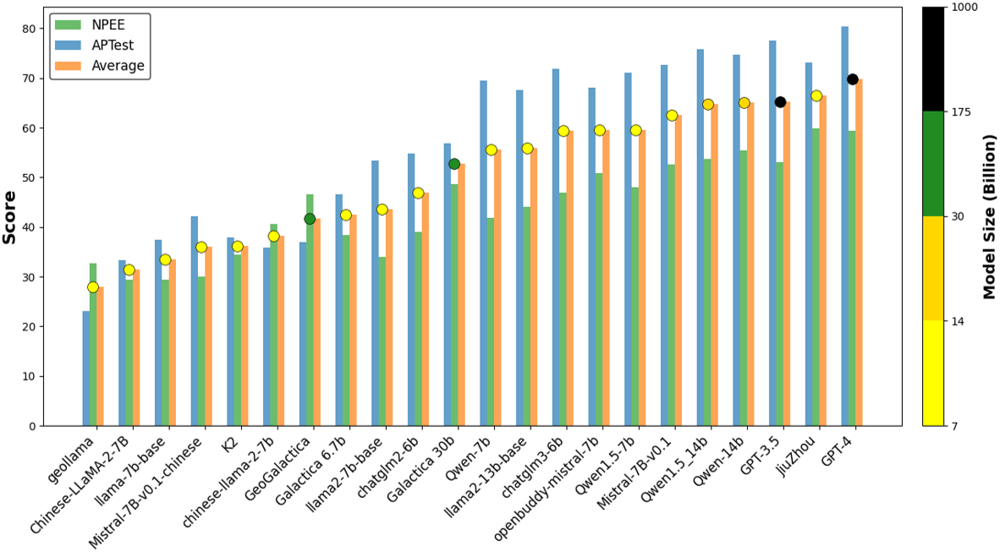
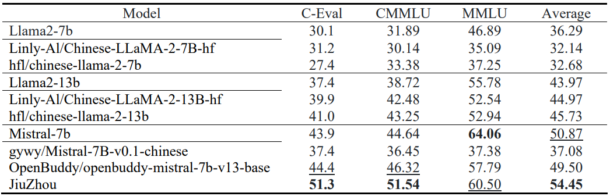
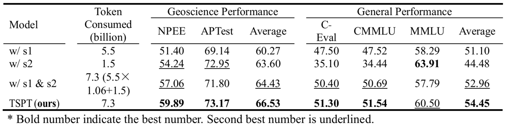

<div align="center">
    <h1>
        JiuZhou: Open Foundation Language Models for Geoscience
    </h1>
</div>


\[ [English](README.md) | 中文 \]

## 🎉 新闻
- [2024-12-31] **文章 [JiuZhou: Open Foundation Language Models and Effective Pre-training Framework for Geoscience](https://www.tandfonline.com/doi/full/10.1080/17538947.2025.2449708) 已被*International Journal of Digital Earth*期刊接收. [Code and Data](https://github.com/THU-ESIS/JiuZhou).**
- [2024-10-11] [新文速递|PreparedLLM：高效训练领域大语言模型的“前预训练”框架](https://mp.weixin.qq.com/s/ugJQ9tbp6Y87xA3TOWteqw)。
- [2024-09-06] 发布[ClimateChat](https://huggingface.co/itpossible/ClimateChat)对话模型。
- [2024-08-31] **文章[PreparedLLM: Effective Pre-pretraining Framework for Domain-specific Large Language Models](https://www.tandfonline.com/doi/full/10.1080/20964471.2024.2396159)已被*Big Earth Data*期刊接收**。
- [2024-08-31] 发布[Chinese-Mistral-7B-Instruct-v0.2](https://huggingface.co/itpossible/Chinese-Mistral-7B-Instruct-v0.2)对话模型。语言理解能力大幅提高，并且具备多轮对话能力。
- [2024-06-30] 发布[JiuZhou-Instruct-v0.2](https://huggingface.co/itpossible/JiuZhou-Instruct-v0.2)对话模型。语言理解能力大幅提高，并且具备多轮对话能力。
- [2024-05-15] 推文[中文扩词表增量预训练大语言模型Chinese-Mistral发布](https://mp.weixin.qq.com/s/PMQmRCZMWosWMfgKRBjLlQ)。
- [2024-04-04] 发布[Chinese-Mistral-7B-Instruct-v0.1](https://huggingface.co/itpossible/Chinese-Mistral-7B-Instruct-v0.1)对话模型。
- [2024-03-31] 发布[Chinese-Mistral-7B-v0.1](https://huggingface.co/itpossible/Chinese-Mistral-7B)基座模型。[Document](https://deepwiki.com/THU-ESIS/Chinese-Mistral).
- [2024-03-15] 发布JiuZhou的base版本[JiuZhou-base](https://huggingface.co/itpossible/JiuZhou-base)、instruct版本[JiuZhou-instruct-v0.1](https://huggingface.co/itpossible/JiuZhou-Instruct-v0.1)，以及[中间检查点](https://huggingface.co/itpossible). [Document](https://deepwiki.com/THU-ESIS/JiuZhou).


## 目录

- [模型介绍](#模型介绍)
- [模型下载](#模型下载)
- [模型推理](#模型推理)
- [模型性能](#模型性能)
- [模型训练过程](#模型训练过程)
- [模型训练代码](#模型训练代码)
- [引用](#引用)
- [致谢](#致谢)

## 模型介绍
地球科学学科已经积累了大量的数据，从这些数据中提取和整合多样化的知识，对于应对全球变化挑战、推动可持续发展和加速科学发现具有重要意义。基础大语言模型首先通过在海量文本数据上进行自监督预训练，自主地学习和整合其中的知识，然后通过指令精调获得解决地球科学问题的能力。然而，当基础语言模型没有掌握足够的地球科学专业知识时，使用相关指令数据进行指令精调可能会导致模型生成与事实不符的内容。为了提高模型的准确性和实用性，我们迫切需要一个强大的地球科学基础语言模型。<br>
本研究将[Mistral-7B-v0.1](https://huggingface.co/mistralai/Mistral-7B-v0.1)作为基座模型，基于大量地球科学语料、[领域大语言模型“前预训练”框架(PreparedLLM)](https://www.tandfonline.com/doi/full/10.1080/20964471.2024.2396159)、“两阶段预训练预适应”算法进行继续预训练，构建了地球科学大语言模型JiuZhou。

## 模型下载
| **模型系列**            | **模型**                           | **下载地址**                               | **说明**                                                          |
|---------------------|----------------------------------|----------------------------------------|-----------------------------------------------------------------|
| **JiuZhou**         | JiuZhou-base                     | [Huggingface](https://huggingface.co/itpossible/JiuZhou-base)                            | 基座模型（具备丰富的地球科学知识）<br>                                     |
| **JiuZhou**                | JiuZhou-Instruct-v0.1            | [Huggingface](https://huggingface.co/itpossible/Chinese-Mistral-7B-Instruct-v0.1)                            | 指令模型（对齐税导致损失了部分地球科学知识，但具备指令遵循能力）<br>中英文alpaca_gpt4和geosignal进行lora微调 |
| **JiuZhou**                | JiuZhou-Instruct-v0.2            | [HuggingFace](https://huggingface.co/itpossible/Chinese-Mistral-7B-Instruct-v0.2)<br>[wisemodel](https://wisemodel.cn/models/itpossible/Chinese-Mistral-7B-Instruct-v0.2)<br>               | 指令模型（对齐税导致损失了部分地球科学知识，但具备指令遵循能力）<br>自制高质量指令数据进行指令调优                  |
| **ClimateChat**         | ClimateChat                      | [HuggingFace](https://huggingface.co/itpossible/ClimateChat)<br>[wisemodel](https://wisemodel.cn/models/itpossible/ClimateChat)<br>               | 指令模型<br>基于JiuZhou-base进行指令调优                                    |
| **Chinese-Mistral** | Chinese-Mistral-7B               | [HuggingFace](https://huggingface.co/itpossible/Chinese-Mistral-7B-v0.1)<br>[wisemodel](https://wisemodel.cn/models/itpossible/Chinese-Mistral-7B-v0.1)<br>[ModelScope](https://www.modelscope.cn/models/itpossible/Chinese-Mistral-7B-v0.1) | 基座模型                                                            |
| **Chinese-Mistral**                | Chinese-Mistral-7B-Instruct-v0.1 | [HuggingFace](https://huggingface.co/itpossible/Chinese-Mistral-7B-Instruct-v0.1)<br>[wisemodel](https://wisemodel.cn/models/itpossible/Chinese-Mistral-7B-Instruct-v0.1)<br>[ModelScope](https://www.modelscope.cn/models/itpossible/Chinese-Mistral-7B-Instruct-v0.1)               | 指令模型<br>中英文alpaca_gpt4进行lora微调                                  |
| **Chinese-Mistral**                | Chinese-Mistral-7B-Instruct-v0.2 | [HuggingFace](https://huggingface.co/itpossible/Chinese-Mistral-7B-Instruct-v0.2)<br>[wisemodel](https://wisemodel.cn/models/itpossible/Chinese-Mistral-7B-Instruct-v0.2)<br> | 指令模型<br>百万条高质量指令进行lora微调                                        |
| **PreparedLLM**     | Prepared-Llama                   | [Huggingface](https://huggingface.co/itpossible/Prepared-Llama)<br>[Wisemodel](https://wisemodel.cn/models/itpossible/PREPARED-Llama)               | 基座模型<br>少量地学数据进行增量预训练<br>推荐使用JiuZhou                            |


## 模型推理
如下是使用JiuZhou-Instruct-v0.2进行推理的代码示例。
```python
import torch
from transformers import AutoTokenizer, AutoModelForCausalLM

device = torch.device("cuda:0") if torch.cuda.is_available() else torch.device("cpu")

model_path = "itpossible/JiuZhou-Instruct-v0.2"
tokenizer = AutoTokenizer.from_pretrained(model_path)
model = AutoModelForCausalLM.from_pretrained(model_path, torch_dtype=torch.bfloat16, device_map=device)

text = "什么是地球科学"
messages = [{"role": "user", "content": text}]

inputs = tokenizer.apply_chat_template(messages, return_tensors="pt").to(device)
outputs_id = model.generate(inputs, max_new_tokens=600, do_sample=True)
outputs = tokenizer.batch_decode(outputs_id, skip_special_tokens=True)[0]
print(outputs)
```

## 模型性能

### 模型地学能力

我们采用GeoBench评测JiuZhou的性能。<br>
JiuZhou在客观题任务上的得分超过了GPT-3.5：
<p align="center">
    <br>
    
    <br>
</p>

JiuZhou在主观题任务上的六个指标的得分超过了基线模型：
<p align="center">
    <br>
    
    <br>
</p>

### 模型通用能力

我们采用C-Eval、CMMLU和MMLU三个评测数据集评估JiuZhou的性能。<br>
相较于其他Llama和Mistral模型的变体，JiuZhou具有突出表现：
<p align="center">
    <br>
    
    <br>
</p>

## 模型训练过程

### 模型语料
语料库来源于5000万篇通用文档和340万篇地学文档。
<p align="center">
    <br>
    
    <br>
</p>

### 训练框架
采用本研究提出的JiuZhou-Framework。
<p align="center">
    <br>
    
    <br>
</p>

### 两阶段预适应预训练算法（TSPT）
提高对有限的地学数据的使用效率，一定程度上突破了增量预训练领域LLM时模型学习低效的技术瓶颈。<br>
TSPT与单阶段训练算法的区别：
<p align="center">
    <br>
    
    <br>
</p>
TSPT与单阶段训练算法的效果比较：
<p align="center">
    <br>
    
    <br>
</p>


## 模型训练代码
如下展示基于[LLaMA-Factory](https://github.com/hiyouga/LLaMA-Factory)开源框架微调JiuZhou。

### 项目部署
```bash
git clone https://github.com/THU-ESIS/JiuZhou.git
cd JiuZhou
pip install -e ".[torch,metrics]"
```
### 模型训练
对JiuZhou进行增量预训练：
```bash
llamafactory-cli train examples/train_lora/JiuZhou_pretrain_sft.yaml
```
对JiuZhou进行指令调优：
```bash
llamafactory-cli train examples/train_lora/JiuZhou_lora_sft.yaml
```
与微调后的JiuZhou对话：
```bash
llamafactory-cli chat examples/inference/JiuZhou_lora_sft.yaml
```
将指令调优得到的lora权重与JiuZhou原始权重进行合并：
```bash
llamafactory-cli export examples/merge_lora/JiuZhou_lora_sft.yaml
```

## 引用
```bibtex
@article{chen2024preparedllm,
  author = {Chen, Zhou and Lin, Ming and Wang, Zimeng and Zang, Mingrun and Bai, Yuqi},
  title = {PreparedLLM: Effective Pre-pretraining Framework for Domain-specific Large Language Models},
  year = {2024},
  journal = {Big Earth Data},
  pages = {1--24},
  doi = {10.1080/20964471.2024.2396159},
  url = {https://doi.org/10.1080/20964471.2024.2396159}
}
```

## 致谢
- [LLaMA-Factory](https://github.com/hiyouga/LLaMA-Factory)
- [OpenCompass](https://github.com/open-compass/opencompass)
- [K2](https://github.com/davendw49/k2)
- [GeoGalactica](https://github.com/geobrain-ai/geogalactica)
- [BB-GeoGPT](https://github.com/AGI-GIS/BB-GeoGPT)
